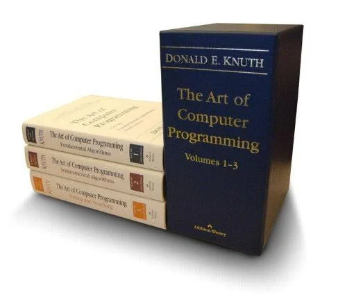
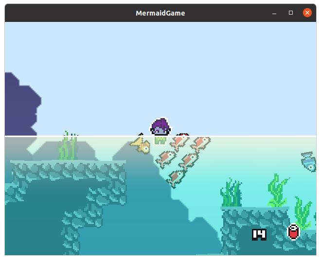

<!--
author:   Andrea Charão

email:    andrea@inf.ufsm.br

version:  0.0.1

language: PT-BR

narrator: Brazilian Portuguese Female

comment: Apresentação no evento interAÇÕES

translation: English  translations/English.md

link:     https://cdn.jsdelivr.net/chartist.js/latest/chartist.min.css

script:   https://cdn.jsdelivr.net/chartist.js/latest/chartist.min.js


onload
window.CodeRunner = {
    ws: undefined,
    handler: {},

    init(url) {
        this.ws = new WebSocket(url);
        const self = this
        this.ws.onopen = function () {
            self.log("connections established");
            setInterval(function() {
                self.ws.send("ping")
            }, 15000);
        }
        this.ws.onmessage = function (e) {
            // e.data contains received string.

            let data
            try {
                data = JSON.parse(e.data)
            } catch (e) {
                self.warn("received message could not be handled =>", e.data)
            }
            if (data) {
                self.handler[data.uid](data)
            }
        }
        this.ws.onclose = function () {
            self.warn("connection closed")
        }
        this.ws.onerror = function (e) {
            self.warn("an error has occurred => ", e)
        }
    },
    log(...args) {
        console.log("CodeRunner:", ...args)
    },
    warn(...args) {
        console.warn("CodeRunner:", ...args)
    },
    handle(uid, callback) {
        this.handler[uid] = callback
    },
    send(uid, message) {
        message.uid = uid
        this.ws.send(JSON.stringify(message))
    }
}

//window.CodeRunner.init("wss://coderunner.informatik.tu-freiberg.de/")
//window.CodeRunner.init("wss://ancient-hollows-41316.herokuapp.com/")
window.CodeRunner.init("wss://testing-coderunner.andreaschwertne.repl.co/")
//window.CodeRunner.init("ws://127.0.0.1:8000/")

@end


@LIA.c:       @LIA.eval(`["main.c"]`, `gcc -Wall main.c -o a.out`, `./a.out`)
@LIA.clojure: @LIA.eval(`["main.clj"]`, `none`, `clojure -M main.clj`)
@LIA.cpp:     @LIA.eval(`["main.cpp"]`, `g++ main.cpp -o a.out`, `./a.out`)
@LIA.go:      @LIA.eval(`["main.go"]`, `go build main.go`, `./main`)
@LIA.haskell: @LIA.eval(`["main.hs"]`, `ghc main.hs -o main`, `./main`)
@LIA.java:    @LIA.eval(`["@0.java"]`, `javac @0.java`, `java @0`)
@LIA.julia:   @LIA.eval(`["main.jl"]`, `none`, `julia main.jl`)
@LIA.mono:    @LIA.eval(`["main.cs"]`, `mcs main.cs`, `mono main.exe`)
@LIA.nasm:    @LIA.eval(`["main.asm"]`, `nasm -felf64 main.asm && ld main.o`, `./a.out`)
@LIA.python:  @LIA.python3
@LIA.python2: @LIA.eval(`["main.py"]`, `python2.7 -m compileall .`, `python2.7 main.pyc`)
@LIA.python3: @LIA.eval(`["main.py"]`, `none`, `python3 main.py`)
@LIA.r:       @LIA.eval(`["main.R"]`, `none`, `Rscript main.R`)
@LIA.rust:    @LIA.eval(`["main.rs"]`, `rustc main.rs`, `./main`)
@LIA.zig:     @LIA.eval(`["main.zig"]`, `zig build-exe ./main.zig -O ReleaseSmall`, `./main`)

@LIA.dotnet:  @LIA.dotnet_(@uid)

@LIA.dotnet_
<script>
var uid = "@0"
var files = []

files.push(["project.csproj", `<Project Sdk="Microsoft.NET.Sdk">
  <PropertyGroup>
    <OutputType>Exe</OutputType>
    <TargetFramework>net6.0</TargetFramework>
    <ImplicitUsings>enable</ImplicitUsings>
    <Nullable>enable</Nullable>
  </PropertyGroup>
</Project>`])

files.push(["Program.cs", `@input(0)`])

send.handle("input", (e) => {
    CodeRunner.send(uid, {stdin: e})
})
send.handle("stop",  (e) => {
    CodeRunner.send(uid, {stop: true})
});


CodeRunner.handle(uid, function (msg) {
    switch (msg.service) {
        case 'data': {
            if (msg.ok) {
                CodeRunner.send(uid, {compile: "dotnet build -nologo"})
            }
            else {
                send.lia("LIA: stop")
            }
            break;
        }
        case 'compile': {
            if (msg.ok) {
                if (msg.message) {
                    if (msg.problems.length)
                        console.warn(msg.message);
                    else
                        console.log(msg.message);
                }

                send.lia("LIA: terminal")
                console.clear()
                CodeRunner.send(uid, {exec: "dotnet run"})
            } else {
                send.lia(msg.message, msg.problems, false)
                send.lia("LIA: stop")
            }
            break;
        }
        case 'stdout': {
            if (msg.ok)
                console.stream(msg.data)
            else
                console.error(msg.data);
            break;
        }

        case 'stop': {
            if (msg.error) {
                console.error(msg.error);
            }

            if (msg.images) {
                for(let i = 0; i < msg.images.length; i++) {
                    console.html("<hr/>", msg.images[i].file)
                    console.html("")
                }

            }

            send.lia("LIA: stop")
            break;
        }

        default:
            console.log(msg)
            break;
    }
})


CodeRunner.send(
    uid, { "data": files }
);

"LIA: wait"
</script>
@end

@LIA.eval:  @LIA.eval_(false,@uid,`@0`,@1,@2)

@LIA.evalWithDebug: @LIA.eval_(true,@uid,`@0`,@1,@2)

@LIA.eval_
<script>
const uid = "@1"
var order = @2
var files = []

if (order[0])
  files.push([order[0], `@'input(0)`])
if (order[1])
  files.push([order[1], `@'input(1)`])
if (order[2])
  files.push([order[2], `@'input(2)`])
if (order[3])
  files.push([order[3], `@'input(3)`])
if (order[4])
  files.push([order[4], `@'input(4)`])
if (order[5])
  files.push([order[5], `@'input(5)`])
if (order[6])
  files.push([order[6], `@'input(6)`])
if (order[7])
  files.push([order[7], `@'input(7)`])
if (order[8])
  files.push([order[8], `@'input(8)`])
if (order[9])
  files.push([order[9], `@'input(9)`])


send.handle("input", (e) => {
    CodeRunner.send(uid, {stdin: e})
})
send.handle("stop",  (e) => {
    CodeRunner.send(uid, {stop: true})
});


CodeRunner.handle(uid, function (msg) {
    switch (msg.service) {
        case 'data': {
            if (msg.ok) {
                CodeRunner.send(uid, {compile: @3})
            }
            else {
                send.lia("LIA: stop")
            }
            break;
        }
        case 'compile': {
            if (msg.ok) {
                if (msg.message) {
                    if (msg.problems.length)
                        console.warn(msg.message);
                    else
                        console.log(msg.message);
                }

                send.lia("LIA: terminal")
                CodeRunner.send(uid, {exec: @4})

                if(!@0) {
                  console.clear()
                }
            } else {
                send.lia(msg.message, msg.problems, false)
                send.lia("LIA: stop")
            }
            break;
        }
        case 'stdout': {
            if (msg.ok)
                console.stream(msg.data)
            else
                console.error(msg.data);
            break;
        }

        case 'stop': {
            if (msg.error) {
                console.error(msg.error);
            }

            if (msg.images) {
                for(let i = 0; i < msg.images.length; i++) {
                    console.html("<hr/>", msg.images[i].file)
                    console.html("")
                }

            }

            send.lia("LIA: stop")
            break;
        }

        default:
            console.log(msg)
            break;
    }
})


CodeRunner.send(
    uid, { "data": files }
);

"LIA: wait"
</script>
@end


-->
<!--
nvm use v14.21.1
liascript-devserver --input README.md --port 3001 --live
link:     https://cdn.jsdelivr.net/gh/liascript/custom-style/custom.min.css
          https://cdn.jsdelivr.net/gh/andreainfufsm/elc106-2023a/classes/12/custom.css

-->


# Algoritmos, códigos e programação

> Aliados da criatividade!


## Programação 

### É uma arte?!



### É um superpoder!?


## Um tema, uma criação, um código


```
 _______    _______  __   __  _______  __   __  _______  ___      _______  _______ 
|       |  |       ||  |_|  ||       ||  |_|  ||       ||   |    |       ||       |
|____   |  |    ___||       ||    ___||       ||    _  ||   |    |   _   ||  _____|
 ____|  |  |   |___ |       ||   |___ |       ||   |_| ||   |    |  | |  || |_____ 
| ______|  |    ___| |     | |    ___||       ||    ___||   |___ |  |_|  ||_____  |
| |_____   |   |___ |   _   ||   |___ | ||_|| ||   |    |       ||       | _____| |
|_______|  |_______||__| |__||_______||_|   |_||___|    |_______||_______||_______|

```
https://patorjk.com/software/taag/#p=display&f=Modular&t=2%20exemplos


### Games de Paradigmas de Programação

Um tema: Ciência, Biologia e Meio Ambiente


Uma criação: muitos games!



Um código:

``` java
package com.alegz.mermaid;

import com.alegz.mermaid.rendering.Renderer;
import com.alegz.mermaid.rendering.material.Material;
import com.alegz.mermaid.states.GameState;
import com.alegz.mermaid.states.MenuState;
import com.alegz.mermaid.utils.GameUtils;
import com.badlogic.gdx.ApplicationListener;
import com.badlogic.gdx.Gdx;
import com.badlogic.gdx.math.Matrix4;

public class MermaidGame implements ApplicationListener
{
	private Assets assets;
	
	private Renderer renderer;
	private float t;
	
	private GameState gameState;
	private GameState transitionState;
	
	@Override
	public void create () 
	{
		assets = new Assets();
		assets.load();
		
		renderer = new Renderer(1);
		renderer.setProjectionMatrix(new Matrix4().scl(2.0f, 2.0f, 1.0f));
		
		SoundManager.init(assets);
		SoundManager.playMusic();
		
		changeState(new MenuState(this, assets));
	}

	@Override
	public void render () 
	{
		gameState.update();
		if (transitionState != null)
			transition();
		SoundManager.update();
	}
	
	public void setState(GameState newState)
	{
		if (transitionState != null || newState == null)
			return;
		transitionState = newState;
		t = -1.0f;
	}
	
	private void changeState(GameState newState)
	{
		if (newState == null)
			return;
		if (gameState != null)
			gameState.dispose();
		newState.create();
		newState.resize(Gdx.graphics.getWidth(), Gdx.graphics.getHeight());
		gameState = newState;
	}
	
	private void transition()
	{
		float cutout = GameUtils.easeStep(Math.abs(t));
		float flip = t < 0.0f ? 0.0f : 1.0f;
		
		Material transition = assets.getMaterial(Assets.MATERIAL_TRANSITION);
		transition.setFloat("u_cutout", cutout);
		transition.setFloat("u_flip", flip);
		transition.setVector2("u_size", 6.0f * Gdx.graphics.getWidth() / Gdx.graphics.getHeight(), 6.0f);
		
		renderer.begin();
		renderer.setMaterial(transition);
		renderer.draw();
		renderer.end();
		
		float oldT = t;
		t += Gdx.graphics.getDeltaTime();
		if (oldT < 0.0f && t >= 0.0f)
			changeState(transitionState);
		else if (oldT < 1.0f && t >= 1.0f)
			transitionState = null;
	}
	
	@Override
	public void resize(int width, int height)
	{
		gameState.resize(width, height);
	}
	
	@Override
	public void pause()
	{
		gameState.pause();
		SoundManager.stopMusic();
	}
	
	@Override
	public void resume()
	{
		gameState.resume();
		SoundManager.playMusic();
	}
	
	@Override
	public void dispose () 
	{
		gameState.dispose();
		assets.dispose();
	}
}
```
### Visita Autoguiada ao Jardim Botânico


## Um desafio

Um tema:

Um código:

``` python
def f(x):
  return x + 1

print(f(5))
```
@LIA.eval(`["main.py"]`, `none`, `python3 main.py`)


``` python
import requests

url = 'https://script.google.com/macros/s/AKfycbyp7nIYtEIGPmXe53f5wfgxxg7xOgAWm1oVy0jMFbzDH0vBm6-iG5CTT5Ho5R7x7hD0/exec' 

try:
  response = requests.get(url)

  # Check if the request was successful (status code 200)
  if response.status_code == 200:
    json_data = response.json()
    print('JSON Response:')
    print(json_data)
  else:
    print(f'HTTP Error: {response.status_code}')
except requests.exceptions.RequestException as e:
  print(f'Request Exception: {e}')
except ValueError as ve:
  print(f'Error decoding JSON: {ve}')
```
@LIA.eval(`["main.py"]`, `none`, `python3 main.py`)

Muitas ideias:


Código javascript que envia uma ideia

